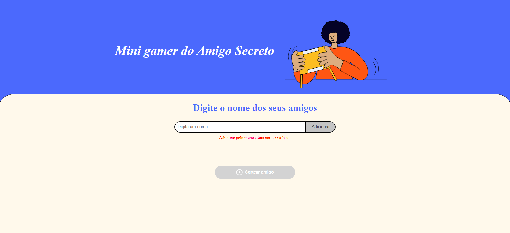

# 🎁 Mini Gamer do Amigo Secreto

[](https://developer.mozilla.org/en-US/docs/Web/HTML)
[](https://developer.mozilla.org/en-US/docs/Web/CSS)
[](https://developer.mozilla.org/en-US/docs/Web/JavaScript)
[](#)

Um jogo simples e interativo para realizar sorteios de **Amigo Secreto** diretamente no navegador, com narração automática e interface amigável.

---

## 📸 Prévia do Jogo

Tela inicial do **Mini Gamer do Amigo Secreto**:



---

## 👨‍💻 Autor

Projeto desenvolvido por:

<p>
  
</p>

<p>
  <span style="font-size:16px; font-weight:bold;">Guilherme Carraro Silva</span>
</p>

---

## 🚀 Tecnologias Utilizadas

<p align="left">
  
  
  
  
</p>

---

## 📂 Estrutura do Projeto

```bash
📦 mini-gamer-amigo-secreto
├── index.html       # Estrutura principal
├── style.css        # Estilos visuais
├── app.js           # Lógica do jogo
└── assets/          # Imagens e ícones


```

## 🎮 Como Jogar

> **Siga estes passos e divirta-se jogando o Mini Gamer do Amigo Secreto!**

1. 🖥️ **Abra o projeto** em um navegador moderno (Chrome, Edge, Firefox, etc).  
2. ✏️ **Digite o nome de cada participante** no campo de texto.  
3. ➕ **Clique em "Adicionar"** ou pressione **Enter** para incluir o amigo na lista.  
   - ⚠️ É necessário adicionar **pelo menos dois nomes** para poder iniciar o sorteio.  
4. 🎲 **Clique em "Sortear amigo"** para escolher aleatoriamente um participante.  
   - 🔊 A narração será feita automaticamente se o áudio estiver habilitado.  
5. 🔁 **Repita o sorteio** até restar apenas **um último amigo**, que será anunciado como o último sorteado.  
6. 🔄 **Clique em "Novo Jogo"** para reiniciar a partida e começar tudo de novo!  

> 💡 **Dica:** Fique atento à lista de amigos e divirta-se com a narração ao vivo de cada sorteio!

---

## 📋 Funcionalidades

> **Recursos do Mini Gamer do Amigo Secreto:**  

- 🎯 Adicionar e remover amigos antes do sorteio  
- 🎲 Sorteio automático e justo dos participantes  
- 🔊 Narração por voz a cada sorteio  
- 🚫 Bloqueio de adição/remoção após iniciar o jogo  
- 🔄 Opção de reiniciar a partida  

---

## 📄 Licença

> Este projeto foi desenvolvido para fins **educacionais** e de prática em **HTML, CSS e JavaScript**.  
>  
> Sinta-se **livre para utilizar, modificar e compartilhar** este projeto!

---
